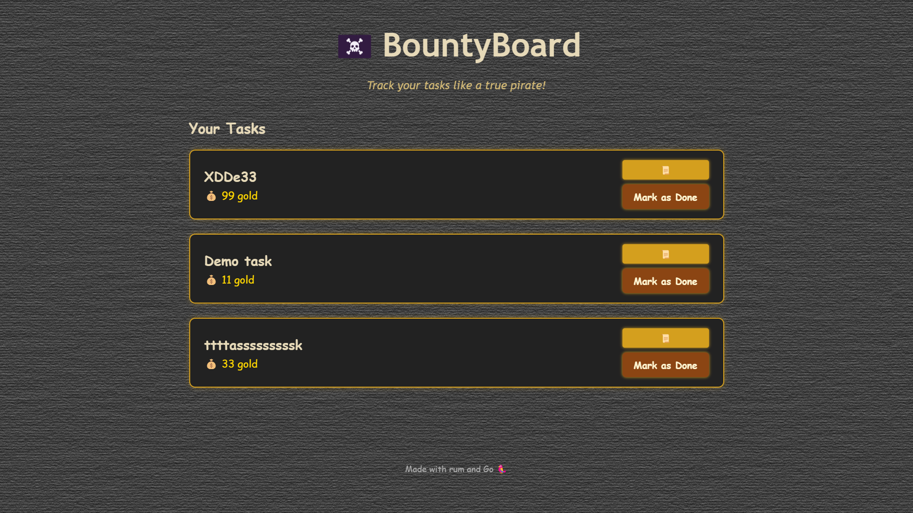

# BountyBoard 🏴‍☠️*

**BountyBoard** — веб-приложение на Go для ведения списка задач в пиратском стиле.  
Каждое задание — это цель с обещанной наградой в виде золота.

Фронтенд реализован на HTML-шаблонах Go.  
Бэкенд построен с разделением на домены, с кэшем и сервисным слоем.

> ⚠️ Этот README (и сам проект) ещё в процессе написания.

