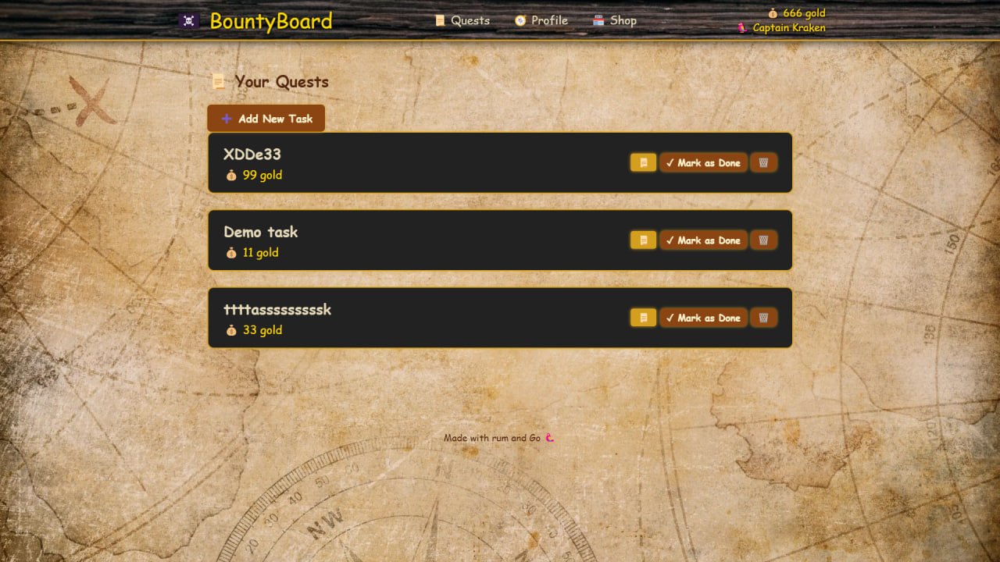

# BountyBoard 🏴‍☠️

**BountyBoard** — веб-приложение на Go для ведения списка задач в пиратском стиле.  
Каждое задание — это цель с обещанной наградой в виде золота.

### 🔧 Особенности реализации:
- **Кэширование** задач с автосохранением в файл (для тестирования)
- In-memory хранилище _(скоро будет заменено на PostgreSQL)_
- Чистая архитектура с разделением слоёв

> ⚠️ Этот README (и сам проект) ещё в процессе написания.

